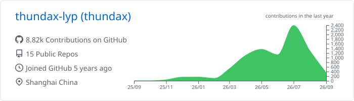
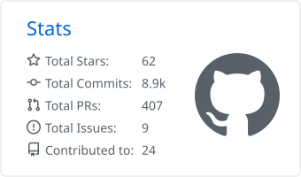
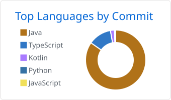
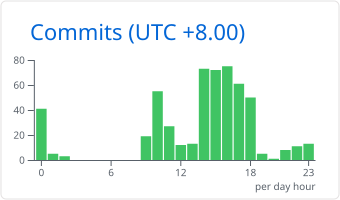

# thundax

    <strong>Applied AI engineer building human-directed agent systems, KG DSL tools, and task-specific models.</strong>

    Open to conversations about opportunities in applied AI and developer tooling.

    
    
    

## Research direction

I study how models and coding agents can become useful in real applications while keeping their outputs reviewable and their behavior constrained by evidence, tests, and architecture rules. My work connects three areas:

- **Agent systems:** human-defined goals, scoped roles, evidence review, and traceable decisions.
- **KG DSL tooling:** grammar-based parsers, IDE feedback, language servers, and visual previews.
- **Model adaptation:** task-specific data preparation, training, inference, and interactive demos.

## Selected work

### Agent systems and AI engineering

- **[Convivium](https://github.com/thundax-lyp/convivium)** — An alpha DeepSeek Harness plugin for human-directed agent work. Typed meeting transitions, role-scoped commands, evidence review, and local audit records make agent contributions inspectable. [Implementation coverage](https://github.com/thundax-lyp/convivium/blob/main/docs/40-readiness/CURRENT-IMPLEMENTATION-COVERAGE.md).
- **[Sandwich](https://github.com/thundax-lyp/sandwich)** — Modernized a legacy JeeSite system under Java 8 and Spring Boot 2.0.5 constraints. Context routing, module boundaries, [architecture tests](https://github.com/thundax-lyp/sandwich/blob/main/sandwish-biz/src/test/java/com/github/thundax/architecture/ServiceDaoBoundaryArchitectureTest.java), and delivery checks support sustained AI-assisted development.

### KG DSL tooling

- **[IntelliJ IDEA plugin](https://github.com/thundax-lyp/openspg-schema-highlighter-idea-plugin)** — Java plugin for OpenSPG SchemaML and Concept Rule: grammar-driven parsing, diagnostics, completion, formatting, [Quick Fixes](https://github.com/thundax-lyp/openspg-schema-highlighter-idea-plugin/tree/main/src/main/java/org/openspg/idea/schema/action), and editor preview.
- **[VS Code extension](https://github.com/thundax-lyp/vscode-extension-openspg-schema)** — TypeScript and ANTLR language tooling with diagnostics, formatting, semantic tokens, navigation, and tests. The [Schema](https://www.npmjs.com/package/openspg-schema-language-server) and [Concept Rule](https://www.npmjs.com/package/openspg-concept-rule-language-server) language servers are published on npm.

### Model training and adaptation

- **[Qwen2.5-Sign](https://huggingface.co/collections/thundax/qwen25-sign)** — Prepared text-to-sign task data and fine-tuned Qwen2.5 models for Chinese sign labels. Built [inference code](https://github.com/thundax-lyp/Qwen2.5-Sign) that maps generated labels to actions and a [Gradio demo](https://huggingface.co/spaces/thundax/Qwen2.5-Sign-WebUI).
- **[Bert-VITS2-Shanghainese](https://huggingface.co/spaces/thundax/Bert-VITS2-Shanghainese)** — Prepared Shanghainese speech data, adapted and trained [Bert-VITS2](https://github.com/fishaudio/Bert-VITS2) for dialect TTS, and deployed a Gradio demo.

## More work

- **[bacon](https://github.com/thundax-lyp/bacon):** A new Java backend spanning seven business domains, with context routing, executable architecture rules, reliability patterns, and auditable task delivery.
- **[DSH Plugin Development](https://github.com/thundax-lyp/dsh-plugin-development):** A version-pinned, offline Agent Skill for building plugins at supported extension points and validating lifecycle contracts.
- **[kuzhambu](https://github.com/thundax-lyp/kuzhambu):** AI-assisted historical content and knowledge graph workflows across Java services, Python workers, and React apps.
- **[scone-ui](https://github.com/thundax-lyp/scone-ui):** A React and Tailwind admin component library with tests, examples, documentation, and an [npm package](https://www.npmjs.com/package/scone-ui).
- **[wechat-tiptap](https://github.com/alin995/wechat-tiptap) (contributor):** Editor menus, image interactions, [outline and status bar](https://github.com/alin995/wechat-tiptap/commit/71a6f484814018790a84bfb0ffabfaf72c1a3bb6), and [streaming AI completion](https://github.com/alin995/wechat-tiptap/commit/83761885670f1ddbd6ad98061195299706882443).

## Engineering practice

- Backend systems: Java, Spring Boot, Spring Cloud, DDD-style modules, mono/micro runtime, idempotency, outbox, and dead-letter flows.
- AI integration: model inference, worker orchestration, OpenAI-compatible interfaces, streaming UX, and human review before results become authoritative.
- Language tooling: ANTLR grammars, LSP servers, diagnostics, formatting, semantic tokens, references, and editor previews.
- Delivery governance: architecture rules, requirements, database design, runbooks, readiness checks, TODO lifecycle, and auditable Git history.

## Stack & design

    
    
    
    
    

    
    
    
    
    
    
    
    

## GitHub snapshot

    

    
    
    

